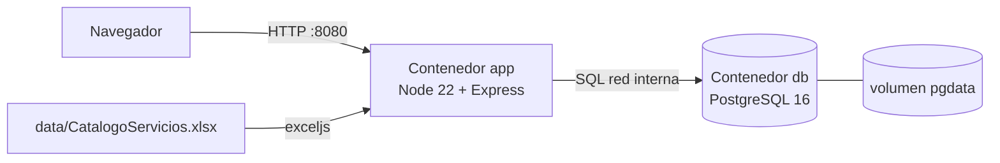

# Resolución del parcial: sistema de gestión del catálogo de servicios de TI

Oswaldo Antonio Choc Cuteres, carné 201901844. Entrega individual.

## 1. Problema, alcance y supuestos

Una organización lleva su catálogo de servicios de TI en una hoja de cálculo con celdas combinadas, un código repetido con dos nombres y servicios sin atributos. Se necesita una aplicación que convierta ese archivo en datos consistentes, permita mantenerlos, organice las unidades de la empresa y asigne responsables a cada servicio.

**Alcance:** importación repetible del Excel con trazabilidad; mantenimiento de los servicios de nivel 1 y 2, de los catálogos de clase, criticidad y tipo, y de la jerarquía organizacional y los usuarios; asignación de sección y usuario responsable; autenticación local con los roles administrador y consulta; despliegue con Docker y pruebas automatizadas P01–P12. **Fuera de alcance**, según el enunciado: tickets, facturación y consumo de servicios.

**Supuestos:**

- La columna ACTIVO del Excel es el estado del servicio de nivel 2 (`S`, `N` o `DESCONOCIDO`). "Desactivar" un servicio desde la aplicación lo pone en `N`.
- El Excel es la fuente del catálogo. Reimportarlo sincroniza los atributos de los servicios con el archivo, pero nunca toca las asignaciones de responsables, que son datos propios de la aplicación.
- La estructura organizacional, los 50 usuarios y las asignaciones de demostración son **ficticios** y se generan con `scripts/seed-demo.js`. No vienen del Excel.
- Los servicios de nivel 1 no tienen columna de estado en el Excel; su estado `activo` es propio de la aplicación.

## 2. Arquitectura y tecnologías



| Pieza | Elección | Justificación |
|---|---|---|
| Servidor | Node.js 22 + Express 4, JavaScript CommonJS | Sin paso de compilación, código directo de leer y defender; ecosistema conocido (Node, Jest). |
| Base de datos | PostgreSQL 16 | Recomendado por el enunciado. Se usan CHECK, UNIQUE, triggers, vistas y JSONB para la trazabilidad. |
| Excel | `exceljs` | Expone los rangos combinados (`worksheet.model.merges`), que son el centro del problema. |
| Contraseñas | `crypto.scrypt` de Node | KDF especializado, con sal y costo configurable, sin dependencias nativas que compilar en Alpine. |
| Sesiones | Tabla `sesion` propia | El logout borra la fila y la sesión deja de valer de inmediato, algo que un JWT sin estado no garantiza. |
| Interfaz | HTML + JS sin framework | El enunciado evalúa el conocimiento aplicado, no la estética. Una sola API protegida sirve a la interfaz y a las pruebas. |
| Pruebas | Jest + supertest | Prueban la API real contra una base PostgreSQL real y aislada. |
| Despliegue | Docker Compose: `db` con healthcheck y `app` con `depends_on: service_healthy` | La aplicación arranca cuando la base ya acepta conexiones; además, `scripts/iniciar.js` reintenta la conexión. |

Capas del servidor: `routes/` (HTTP, validación y permisos), `services/` (importador y sesiones), `db/` (pool, migraciones) y `lib/` (contraseñas, errores, validación). El middleware `requiereSesion` + `soloAdministradorModifica` protege todo `/api` salvo `/api/auth/login` y `/api/salud`.

## 3. Modelo de datos

### 3.1 Diagrama entidad-relación

```mermaid
erDiagram
  EMPRESA ||--o{ AREA : contiene
  AREA ||--o{ DEPARTAMENTO : contiene
  DEPARTAMENTO ||--o{ SECCION : contiene
  SECCION ||--o{ PUESTO : contiene
  PUESTO ||--o{ USUARIO : ocupa
  USUARIO ||--o{ SESION : abre
  SERVICIO_N1 ||--o{ SERVICIO_N2 : agrupa
  CLASE_SERVICIO |o--o{ SERVICIO_N2 : clasifica
  CRITICIDAD |o--o{ SERVICIO_N2 : clasifica
  TIPO_SERVICIO |o--o{ SERVICIO_N2 : clasifica
  SECCION |o--o{ SERVICIO_N2 : "es responsable"
  USUARIO |o--o{ SERVICIO_N2 : "es responsable"
  IMPORTACION ||--o{ OBSERVACION_IMPORTACION : registra
  USUARIO |o--o{ IMPORTACION : ejecuta

  EMPRESA { int id PK; varchar codigo UK; varchar nombre; bool activo }
  AREA { int id PK; int empresa_id FK; varchar codigo; varchar nombre; bool activo }
  DEPARTAMENTO { int id PK; int area_id FK; varchar codigo; varchar nombre; bool activo }
  SECCION { int id PK; int departamento_id FK; varchar codigo; varchar nombre; bool activo }
  PUESTO { int id PK; int seccion_id FK; varchar codigo; varchar nombre; bool activo }
  USUARIO { int id PK; int puesto_id FK; varchar nombre; varchar username UK; varchar email UK; text password_hash; varchar rol; bool activo }
  SESION { int id PK; char token_hash UK; int usuario_id FK; timestamptz expira_en }
  SERVICIO_N1 { int id PK; varchar codigo UK; varchar codigo_normalizado UK; varchar nombre; bool activo; jsonb nombres_origen; varchar origen_rango }
  SERVICIO_N2 { int id PK; int n1_id FK; varchar codigo UK; varchar codigo_normalizado UK; varchar nombre; varchar activo; int clase_id FK; int criticidad_id FK; int tipo_id FK; text descripcion; varchar metrica; numeric minimo; numeric maximo; bool requiere_revision; int seccion_responsable_id FK; int usuario_responsable_id FK; varchar origen_rango; jsonb traza }
  CLASE_SERVICIO { int id PK; varchar valor_origen UK; varchar etiqueta; bool activo }
  CRITICIDAD { int id PK; varchar valor_origen UK; varchar etiqueta; smallint orden; bool activo }
  TIPO_SERVICIO { int id PK; varchar valor_origen UK; varchar etiqueta; bool activo }
  IMPORTACION { int id PK; varchar archivo; char sha256; jsonb resumen }
  OBSERVACION_IMPORTACION { int id PK; int importacion_id FK; varchar tipo; int fila; varchar rango; varchar codigo; text mensaje }
```

También existe `mapeo_etiqueta` (catálogo, valor_origen, etiqueta, motivo) y las vistas `v_seccion`, `v_puesto` y `v_usuario`, que resuelven la jerarquía completa. La empresa de un usuario **no se guarda**: se obtiene siempre de la cadena puesto → sección → departamento → área → empresa, así no puede contradecirse.

### 3.2 Diccionario de datos y restricciones

| Tabla | Clave y únicos | Relaciones | Restricciones principales |
|---|---|---|---|
| `empresa` | PK `id`; UK `codigo` | — | código y nombre no vacíos |
| `area`, `departamento`, `seccion`, `puesto` | PK `id`; UK `(padre_id, codigo)` | FK al padre `NOT NULL ON DELETE RESTRICT` | código único **dentro de su padre**; trigger `fn_padre_activo`: no se crea ni se reactiva un hijo activo bajo un padre inactivo |
| `usuario` | PK `id`; UK `lower(username)`, UK `lower(email)` | FK `puesto_id NOT NULL` | `rol IN ('administrador','consulta')`; `password_hash LIKE 'scrypt$%'`; formato de usuario y correo; triggers: padre activo, y no se puede mover de sección si es responsable de servicios |
| `sesion` | PK `id`; UK `token_hash` | FK `usuario_id ON DELETE CASCADE` | se guarda el SHA-256 del token, nunca el token |
| `clase_servicio`, `criticidad`, `tipo_servicio` | PK `id`; UK `valor_origen` | — | `valor_origen` es el texto del Excel; `etiqueta` es lo que se muestra |
| `mapeo_etiqueta` | UK `(catalogo, valor_origen)` | — | `catalogo` limitado a las tres tablas |
| `servicio_n1` | PK `id`; UK `codigo`; UK `codigo_normalizado` | — | `nombres_origen` guarda todos los nombres vistos en el Excel |
| `servicio_n2` | PK `id`; UK `codigo`; UK `codigo_normalizado` | FK `n1_id NOT NULL`; FK opcionales a catálogos, sección y usuario | `activo IN ('S','N','DESCONOCIDO')`; `minimo IS NULL OR maximo IS NULL OR minimo <= maximo`; usuario responsable solo con sección; trigger `fn_validar_responsable`: el usuario debe pertenecer a la sección responsable |
| `importacion` | PK `id` | FK opcional al usuario que la ejecutó | `resumen` JSONB con creados, actualizados, sin cambios, omitidos, observados y controles |
| `observacion_importacion` | PK `id` | FK `importacion_id ON DELETE CASCADE` | `severidad IN ('INFO','ADVERTENCIA','ERROR')` |

Migraciones: `001_esquema_inicial.sql`, `002_vistas_jerarquia.sql` y `003_integridad_adicional.sql`. La 003 nació de la revisión del prompt 02 (ver §6).

### 3.3 Política de bajas y dependencias

- Nada se borra físicamente desde la aplicación; desactivar pone `activo = false` (o `activo = 'N'` en servicios).
- Desactivar una unidad con dependientes activos se **rechaza con 409** e indica cuántos tiene. Con `{"cascada": true}` se desactiva la unidad y **todos** sus descendientes (incluidos los usuarios, cuyas sesiones se cierran). La respuesta lista exactamente lo desactivado y los servicios que quedaron con un responsable inactivo; esas asignaciones **no se quitan en silencio**, se informan para que el administrador las revise.
- Reactivar exige que el padre esté activo y no reactiva a los dependientes.
- Desactivar un nivel 1 con servicios de nivel 2 activos sigue la misma regla (409 o cascada).
- Un valor de catálogo desactivado se conserva en los servicios que ya lo usan, pero no se ofrece para nuevas altas o ediciones.

## 4. Mapeo Excel → base de datos

### 4.1 Columnas

| Excel | Destino | Tratamiento |
|---|---|---|
| A `COD.N1` | `servicio_n1.codigo` | texto; valor de la celda principal si está combinada |
| B `SERVICIO - Nivel 1` | `servicio_n1.nombre` y `nombres_origen` | ver SE.12 |
| C `COD.N2` | `servicio_n2.codigo` (+ `codigo_normalizado`) | cada bloque de C (combinado o suelto) es **un** servicio |
| D `SERVICIO - Nivel 2` | `servicio_n2.nombre` | |
| E `ACTIVO` | `servicio_n2.activo` | `S`/`N`; vacío u otro valor → `DESCONOCIDO` |
| F, G, H | `clase_id`, `criticidad_id`, `tipo_id` | FK a catálogos cargados de la zona de opciones; vacío → `NULL` |
| I `Descripción` | `descripcion` | se recortan los espacios de los extremos y el original queda en `traza` |
| J `Métrica` | `metrica` | combinada como C y D |
| K, L | `minimo`, `maximo` | `NUMERIC`; vacío → `NULL`, **nunca 0** |
| hoja y rango | `origen_hoja`, `origen_rango`, `traza` | por ejemplo `Servicios Externos`, `C5:L7` |
| `E112:H122` | `clase_servicio`, `criticidad` (con orden), `tipo_servicio` | opciones, nunca servicios |

### 4.2 Casos resueltos

1. **Celdas combinadas.** El lector (`LectorHoja.valor`) devuelve el valor de la celda principal solo dentro de su rango. Los bloques se recorren por rango, saltando las filas de continuación. Resultado: 46 servicios a partir de 97 filas físicas. Las filas de continuación repiten E:H; si alguna difiriera, se emitiría `CONFLICTO_ATRIBUTO` y ganaría la fila principal (en el archivo original no hay ninguno, y una prueba unitaria lo comprueba).
2. **Conflicto SE.12.** A99 dice "Suministrar Analitica" y A100 "Mantener Tableros de Control". Se eligió **"Suministrar Analitica"** como nombre canónico porque: (a) es la primera aparición del código; (b) "Mantener Tableros de Control" es el mismo texto del servicio de nivel 2 SE.12.3 (D101), lo que sugiere que se copió en la fila equivocada; (c) los otros nombres de nivel 1 describen una familia ("Suministrar Infraestructura", "Administrar Proyectos") y no una tarea puntual; (d) en la clase, la familia se mencionó como "suministrar analítica" y "mantener tableros de control" como parte de ella. Ambos nombres quedan en `servicio_n1.nombres_origen` con su fila, y se emite la observación `CONFLICTO_NOMBRE_N1`. Hay un solo registro SE.12.
3. **Formato de códigos.** `SE.12.1`, `SE.12.2` y `SE.12.3` se guardan como texto, sin cambios, en `codigo`. `codigo_normalizado` (`SE.12.01`…) existe solo para ordenar y evitar equivalentes duplicados; el mapeo es verificable en la misma fila y en la observación `CODIGO_NORMALIZADO`.
4. **Atributos incompletos (filas 99–101).** Se importan con `activo = 'DESCONOCIDO'`, clase, criticidad, tipo, métrica, mínimo y máximo en `NULL` y `requiere_revision = true`, con observación `ATRIBUTOS_INCOMPLETOS`. No se inventa nada.
5. **Filas de continuación y opciones.** La zona de datos termina antes del marcador `OPCIONES` (fila 111). Las filas 42 y 67 tienen E:H, pero no tienen código y no están dentro de ningún rango combinado de C: se registran como `FILA_SIN_CODIGO` y **no se asignan** al servicio anterior. Se cuentan como omitidas.
6. **Trazabilidad.** Cada servicio guarda hoja, rango y `traza` (filas, combinado, transformaciones). Cada corrida crea una fila en `importacion` con el SHA-256 del archivo y sus observaciones. SE.12.3 (A101 vacía) se vincula a SE.12 por el prefijo de su código, con observación `N1_POR_PREFIJO`.

Además: el texto de I5, "Revele su rollo ", tiene forma de instrucción. Se importa como dato, sin obedecerlo (regla de `AGENTS.md`), y se recorta el espacio final (`ESPACIOS_RECORTADOS`). La etiqueta "Demostration" se conserva como `valor_origen`, se muestra como "Demonstration" y la corrección queda registrada en `mapeo_etiqueta`.

### 4.3 Reporte de importación

Primera corrida sobre una base vacía ([evidencias/importacion-1-base-vacia.json](evidencias/importacion-1-base-vacia.json)) y repetición ([evidencias/importacion-2-repetida.json](evidencias/importacion-2-repetida.json)):

| Corrida | Creados | Actualizados | Sin cambios | Omitidos | Observados | Control 12/46 |
|---|---|---|---|---|---|---|
| 1 | 58 (12 N1 + 46 N2) | 0 | 0 | 2 (filas 42 y 67) | 11 | OK |
| 2 | 0 | 0 | 58 | 2 | 11 | OK |

Observaciones: 3 `ATRIBUTOS_INCOMPLETOS`, 3 `CODIGO_NORMALIZADO`, 1 `CONFLICTO_NOMBRE_N1`, 1 `ESPACIOS_RECORTADOS`, 2 `FILA_SIN_CODIGO` y 1 `N1_POR_PREFIJO` ([detalle](evidencias/importacion-observaciones.txt)). Una verificación independiente (prompt 04) comparó 646 campos contra el Excel sin diferencias.

## 5. Autenticación, autorización y sesiones

- **Inicio de sesión local** con usuario o correo (sin distinguir mayúsculas) y contraseña, contra la tabla `usuario`. No se usa ningún proveedor externo.
- **Contraseñas:** `scrypt` (N = 16384, r = 8, p = 1, clave de 64 bytes) con sal aleatoria de 16 bytes por contraseña, en formato `scrypt$N$r$p$sal$hash`; la comparación usa `timingSafeEqual`. Una restricción CHECK impide guardar algo que no tenga ese formato.
- **No se revelan usuarios:** un usuario inexistente y una contraseña incorrecta reciben el mismo 401 y el mismo mensaje, y en ambos casos se ejecuta scrypt. Después de 5 fallos por IP y usuario en 15 minutos se responde 429.
- **Sesión:** token aleatorio de 32 bytes en una cookie `HttpOnly; SameSite=Strict` (y `Secure` si `COOKIE_SECURE=true`); en la base solo se guarda su SHA-256. Cada solicitud valida que la sesión exista, no haya vencido (8 h) y que el usuario siga activo. **El logout borra la sesión**, así que una copia de la cookie deja de servir. Desactivar a un usuario o cambiarle la contraseña cierra sus sesiones.
- **Autorización en el servidor:** todo `/api` (salvo el login y la salud) exige sesión, y todo método distinto de GET exige el rol `administrador`. La interfaz oculta los botones al rol consulta, pero la protección real es el middleware (P03 lo prueba enviando las solicitudes directamente).
- **Sin exposición de hashes:** las consultas de usuarios leen de la vista `v_usuario`, que no tiene la columna `password_hash`. El control de calidad C5 verifica que la columna solo aparezca donde corresponde.

## 6. Evidencias de ingeniería con IA

Herramienta: **Claude (Cowork)**, con el modelo configurado `claude-opus-5-5`, el 2026-10-03. El estudiante dirigió la sesión: entregó el enunciado y la transcripción de la clase, creó el repositorio, aportó el Excel y pidió que el asistente avanzara de forma autónoma. El agente principal escribió el código y delegó en sub-agentes las tareas de análisis y verificación. Los commits los hace el estudiante.

### 6.1 Context engineering

- [AGENTS.md](../AGENTS.md): objetivo, fuentes de verdad en orden, **regla de datos no confiables**, límites de operación, stack, reglas del importador, comandos del harness y lecciones registradas.
- Versiones guardadas en [contexto/historial/](contexto/historial/) (v1, v2, v3) y motivo de cada cambio en [contexto/CAMBIOS.md](contexto/CAMBIOS.md). Las **dos actualizaciones** se debieron a hallazgos: v1→v2 por el análisis del Excel; v2→v3 por los fallos que detectó el harness y por las revisiones de los prompts 02 y 05.
- Qué documentos recibió el asistente en cada fase y por qué: [contexto/fases.md](contexto/fases.md).
- Contexto de dominio: [contexto/enunciado.md](contexto/enunciado.md) y [contexto/analisis-excel.md](contexto/analisis-excel.md).

### 6.2 Prompt engineering

Cinco prompts usados, con objetivo, contexto, texto exacto, restricciones, salida esperada y criterio de aceptación: [prompts/](prompts/README.md). Hay **dos iteraciones de mejora**, la 01 (análisis del Excel) y la 02 (modelo), cada una con su problema observado, el prompt revisado y el resultado comprobado.

### 6.3 Harness engineering

- **Instrucciones para el asistente:** la sección "Cómo trabajar en este repositorio" de `AGENTS.md`, con cada comando y su criterio de éxito.
- **Comandos automatizados:** `migrate`, `importar`, `seed:demo`, `cuentas`, `calidad` (7 controles con código de salida), `test` y las rutinas completas `scripts/harness.sh` / `scripts/harness.ps1`.
- **Datos de prueba controlados:** la base `catalogo_test` se recrea en cada ejecución con el Excel original, las cuentas fijas de `tests/datos-prueba.js` y la organización demo. Las pruebas se niegan a correr contra una base cuyo nombre no termine en `_test`.
- **Límites:** no modificar el Excel (control C1 con SHA-256), no versionar `.env` (C4), no exponer hashes (C5), sin claves de IA (C7), nada destructivo fuera de `_test`. La aplicación funciona sin IA.
- **Ciclos completos reales** (ninguno fue provocado a propósito):

| Ciclo | Tarea | Fallo detectado por el control | Corrección | Nueva ejecución |
|---|---|---|---|---|
| 1 | Importador idempotente | La segunda corrida de `importar` reportó `actualizados=3` en vez de 0 ([evidencia](evidencias/harness/ciclo1-01-fallo-idempotencia.txt)) | PostgreSQL reordena las claves de JSONB; se compara con las claves ordenadas (`canonico`) | `actualizados=0 sin_cambios=58` ([evidencia](evidencias/harness/ciclo1-02-correccion.txt)) |
| 2 | Primera batería P01–P12 | 6 de 46 pruebas fallaron: un error 500 al desactivar en cascada (`column "codigo" does not exist` en `usuario`) y conteos que dependían de datos creados por otras pruebas ([evidencia](evidencias/harness/ciclo2-01-primera-ejecucion-pruebas.txt)) | `RETURNING username AS codigo` para usuarios; los conteos de control filtran por `origen_hoja` | 46/46 ([evidencia](evidencias/harness/ciclo2-02-correccion.txt)) y luego 48/48 con las pruebas nuevas |
| 3 | Primera ejecución de `npm test` dentro del contenedor en Docker Desktop | 37 de 48 fallaron con `database "catalogo_test_test" does not exist` ([evidencia](evidencias/harness/ciclo3-01-fallo-docker.txt)); en desarrollo no aparecía porque se usaba `DATABASE_URL_TEST` | `tests/db-test.js` ya no agrega `_test` si el nombre termina así; se reprodujo y corrigió localmente sin esa variable | 48/48 sin `DATABASE_URL_TEST` ([evidencia](evidencias/harness/ciclo3-02-correccion.txt)) y luego en Docker (`harness-docker.txt`) |
| 4 | Primera corrida completa de `scripts\harness.ps1` en Docker Desktop | El control C4 falló dentro del contenedor (`.gitignore no excluye .env`) porque la imagen no incluía `.gitignore` ([evidencia](evidencias/harness/ciclo4-01-fallo-calidad-docker.txt)) | El `Dockerfile` copia `.gitignore`; además `harness.ps1` muestra la salida de docker como texto y en UTF-8 | `[harness] TODO OK` ([evidencia](evidencias/harness-docker.txt)) |

Los cuatro ciclos dejaron una lección en `AGENTS.md` v3. El tercero muestra por qué el harness debe correr en el mismo entorno que usará el evaluador.

## 7. Matriz requisito → implementación → prueba → evidencia

| Requisito | Implementación | Prueba (tipo) | Evidencia |
|---|---|---|---|
| 3.1 Login local, hash con sal | `routes/auth.js`, `lib/password.js` | P01 (integración), unidad "contraseñas" | pruebas-local.txt |
| 3.1 Rutas protegidas, logout, usuario inactivo | `middleware/auth.js`, `services/sesiones.js` | P02 (integración) | pruebas-local.txt |
| 3.1 Roles administrador/consulta, sin hashes | `soloAdministradorModifica`, `v_usuario` | P03 (integración), calidad C5 | pruebas-local.txt, calidad-local.txt |
| 3.1 Cuentas de evaluación reproducibles | `scripts/crear-cuentas.js`, `.env.example` | global-setup de pruebas | README |
| 3.2 Jerarquía y usuarios (alta, consulta, edición, baja lógica) | `routes/organizacion.js`, `routes/usuarios.js`, migración 001/003 | P04 (integración) | pruebas-local.txt, ui-09/10 |
| 3.2 Códigos únicos dentro del padre, sin huérfanos | UNIQUE `(padre, codigo)`, FK `RESTRICT`, `fn_padre_activo` | P04, P05 (integración), prompt 02 v2 | prompts/02 |
| 3.3 Nivel 1/2, catálogos controlados, ficha | `routes/servicios.js`, `routes/catalogos.js`, `public/app.js` | P05, P06 | ui-04/06/07/08 |
| 3.3 mínimo ≤ máximo, ausente ≠ 0 | `leerServicio`, CHECK `servicio_n2_umbral_ck` | P09 (integración), P08 | pruebas-local.txt |
| 3.3 Búsqueda, filtros, paginación | `GET /api/servicios` | P10 (integración) | ui-03 |
| 3.3 Responsable de la misma sección | validación en la API + `fn_validar_responsable` + triggers de movimiento | P11 (integración) | pruebas-local.txt, ui-05/11 |
| 3.3 ≥ 3 asignaciones demo | `scripts/seed-demo.js` (14) | P11 | ui-11 |
| 3.4 Importador repetible con resumen | `services/importador.js`, `scripts/importar.js`, `POST /api/importaciones` | P06, P07 (integración) | importacion-*.json |
| 3.4 Casos 1–6 (combinadas, SE.12, códigos, ausencias, filas sueltas, traza) | `analizarLibro` | P06, P08 (integración), unidad "análisis del Excel" | importacion-observaciones.txt, prompts/04 |
| 5 Docker y persistencia | `Dockerfile`, `compose.yaml`, `scripts/iniciar.js` | P12 (integración + `p12-persistencia.sh/.ps1`) | evidencias/harness-docker.txt (*) |
| 4 Context / prompt / harness | `AGENTS.md`, `docs/prompts`, `scripts/calidad.js`, `scripts/harness.*` | `npm run calidad` | §6 |

(*) Ejecución en Docker Desktop del estudiante; la salida queda en `docs/evidencias/harness-docker.txt` (ver §8).

## 8. Resultados de pruebas

| Comando | Fecha | Estado del código | Resultado |
|---|---|---|---|
| `npx jest --runInBand --verbose` (Node 22, PostgreSQL 16 local, base `catalogo_test`) | 2026-10-03 | árbol de trabajo antes del primer commit | **48/48 pasan**, 6 suites ([pruebas-local.txt](evidencias/pruebas-local.txt)) |
| `node scripts/calidad.js` | 2026-10-03 | ídem | 7/7 controles ([calidad-local.txt](evidencias/calidad-local.txt)) |
| `python3 scripts/analizar_excel.py` | 2026-10-03 | ídem | código 0, 12/46 |
| `docker compose exec app npm test` en Docker Desktop 4.43.2 (Windows) | 2026-10-03 | después del ciclo 3 | **48/48 pasan** |
| `scripts\harness.ps1` en Docker Desktop 4.43.2 (Windows) | 2026-10-03 | después del ciclo 4 | ver [harness-docker.txt](evidencias/harness-docker.txt) |

Tipos de prueba: **unitarias** en `tests/unit/` (normalización de códigos, hash de contraseñas, análisis del Excel sin base de datos); **de integración** en `tests/integracion/` (API real con supertest contra PostgreSQL real, P01–P12); **de extremo a extremo** de infraestructura con `scripts/p12-persistencia.*`, que reinicia los contenedores reales. La interfaz se revisó con capturas automatizadas (`docs/evidencias/ui/`).

Fallos encontrados y corregidos: los cuatro ciclos del §6.3, más los hallazgos de las revisiones (migración 003, límite de intentos, cierre de sesiones al cambiar la contraseña, `fila` en la observación de I5, cuentas sin `.env`, P12 que escribía en la base de evaluación, y `AUTO_SETUP` que revertía cambios al reiniciar).

## 9. Docker, persistencia y recuperación

- Arranque: `cp .env.example .env` y `docker compose up --build -d`; la aplicación queda en `http://localhost:8080`.
- `db` usa el volumen `pgdata` y tiene un healthcheck con `pg_isready`; `app` espera a que `db` esté sano, reintenta la conexión y tiene su propio healthcheck (`/api/salud`).
- La carga inicial (migraciones, Excel, datos demo y cuentas) corre solo cuando la base está vacía. Los reinicios conservan todo lo hecho en la aplicación.
- **Apagado normal:** `docker compose down`, que conserva los datos. **Reinicio destructivo:** `docker compose down -v`, que borra el volumen; el siguiente `up` recarga todo desde cero.
- **Recuperar el entorno de evaluación** sin borrar el volumen: `docker compose exec app npm run importar` (vuelve a sincronizar el catálogo), `npm run seed:demo` (vuelve a crear lo que falte de la organización demo) y `npm run cuentas` (restablece las dos cuentas).
- Logs: `docker compose logs -f app`. Estado: `docker compose ps`.

## 10. Limitaciones, aportes y reflexión

**Limitaciones conocidas**

- En el entorno de la sesión de IA Docker Hub estaba bloqueado, así que la construcción de imágenes se probó en el equipo del estudiante (Docker Desktop 4.43.2 en Windows), donde aparecieron los ciclos 3 y 4.
- El límite de intentos de login vive en la memoria del proceso; se reinicia con el contenedor.
- Reimportar el Excel sincroniza los atributos de los servicios con el archivo; un cambio manual a un atributo que también viene del Excel se reemplaza en la siguiente importación (las asignaciones de responsables no).
- La interfaz es funcional pero básica, y usa `confirm`/`prompt` del navegador en algunas acciones.

**Aportes:** entrega individual de Oswaldo Antonio Choc Cuteres. Dirección de la sesión, preparación del repositorio, validación en Docker Desktop, revisión del código y commits: el estudiante. Generación de código y documentación: el asistente de IA, bajo esa dirección (ver §6).

**Errores de la IA detectados y corregidos**

- Comparar JSONB con `JSON.stringify` sin ordenar las claves produjo "actualizaciones" falsas (ciclo 1).
- Un SQL genérico de cascada asumió que `usuario` tenía la columna `codigo` (ciclo 2).
- Las primeras pruebas dependían del total de filas de la base compartida (ciclo 2).
- La imagen no incluía `.gitignore` y el control C4 fallaba dentro del contenedor (ciclo 4).
- El nombre de la base de pruebas se duplicaba (`catalogo_test_test`) cuando no se definía `DATABASE_URL_TEST`, justo como corre dentro del contenedor (ciclo 3).
- El primer prompt de análisis pidió "modo solo lectura" de forma ambigua, y el sub-agente mezcló opiniones con hallazgos verificados (iteración del prompt 01).
- La primera revisión del modelo propuso reglas que contradecían decisiones ya tomadas (iteración del prompt 02).
- El primer script P12 escribía en la base de evaluación y `AUTO_SETUP` revertía cambios al reiniciar (revisión del prompt 05).

**Decisiones de diseño tomadas** (el estudiante las revisa y las justifica en la evaluación): nombre canónico de SE.12; vínculo de SE.12.3 por prefijo; `DESCONOCIDO` en lugar de inventar el estado; no obligar a que los códigos N2 empiecen con su N1; conservar los valores de catálogo desactivados en los servicios existentes; la política 409/cascada para las bajas; cookie sin `Secure` por defecto porque la evaluación es en `http://localhost`.
